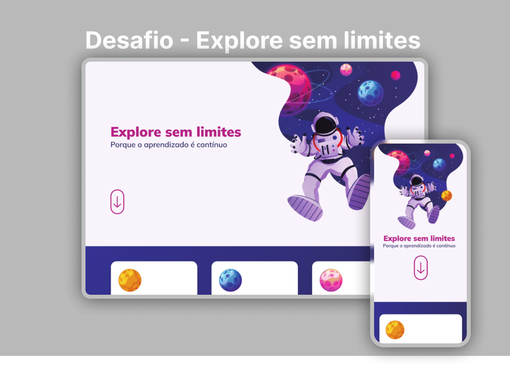

  

<h1 align="center">Desafio - Explore sem limites. Projeto do Explorer - Rocketseat</h1>

 

  
  <a href="https://jlisarte.github.io/projeto_projeto_exploresemlimites/" target="_blank">https://jlisarte.github.io/projeto_exploresemlimites/</a>

## 🚀 Tecnologias

Esse projeto foi desenvolvido com as seguintes tecnologias:

- HTML e CSS
- Git e Github
- Figma

## 💻 Projeto

Desafio - Explore sem limites.  
Projeto do Explorer - Rocketseat

---

Feito por Shadowkhan - Juliano Lisarte
